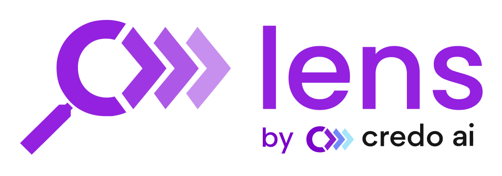
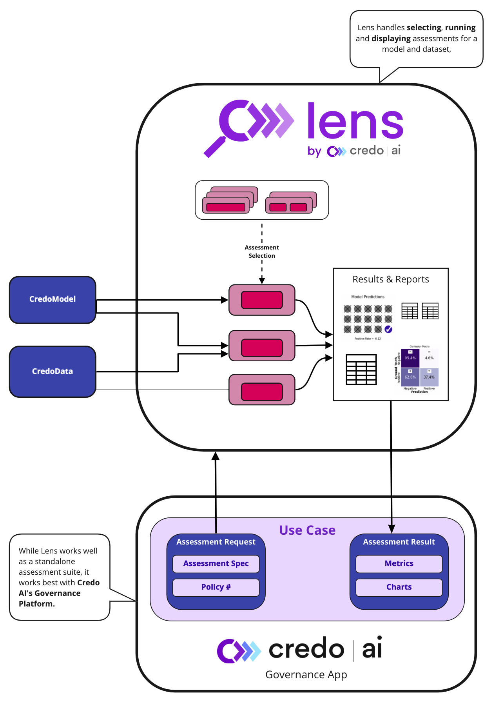
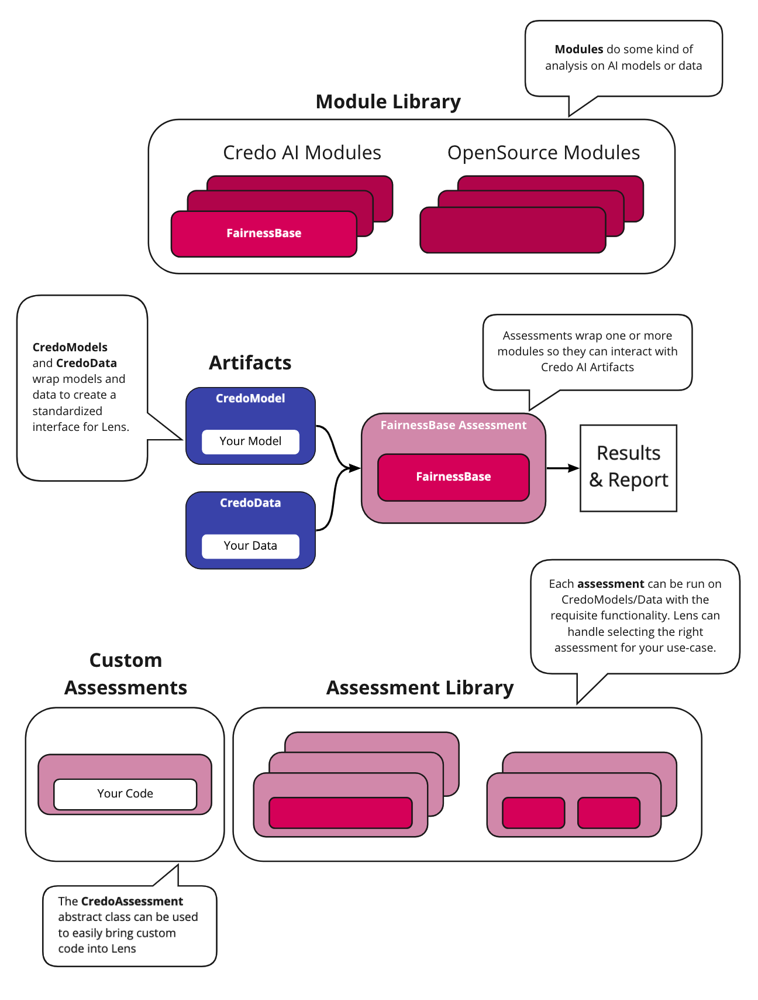

..
   Note: Items in this toctree form the top-level navigation. See `api.rst` for the `autosummary` directive, and for why `api.rst` isn't called directly.

.. toctree::
   :hidden:

   Home page <self>
   Setup <setup>
   Jupyter tutorials <tutorials>
   Reporting <report>
   Metrics <metrics>
   API reference <_autosummary/credoai>

Lens is an AI Assessment Framework. With a focus on responsible AI, Lens makes
comprehensive AI assessment streamlined, structured and interpretable to diverse audiences. Lens
aims to be the single entrypoint to a broad ecosystem of open source assessment
tools developed in industry and academia. It is also extensible, and can accommodate
your own assessment pipeline as custom modules.

Lens allows you to assess your AI systems with respect to:

* Performance
* Fairness
* Security
* Privacy

Lens is developed by Credo AI, and integrates easily with the Credo AI Governance App. The comprehensive
assessments Lens provides is the foundation of AI Governance, but it is only one component! The Governance App helps with 
the rest.

Check out the :ref:`quickstart tutorial <quickstart>` to get started. 

Check out the :ref:`FAQ <lens faq>` for answers to common questions.

If you are connecting to the Credo AI Governance App, see the :ref:`governance integration tutorial <Connecting with the Credo AI Governance App>`.

Overview
--------
Lens is made of a few components.

* **Lens** is the primary interface between models, data, modules and (optionally) the Credo AI Governance App.
* **CredoModel / CredoData** are wrappers to bring models and data into the Lens Framework
* **Modules** are tools to perform assessment-related functions on models and/or data. 
* **Assessments** are the connective tissue between CredoModels and CredoData and modules.

Usage of Lens boils down to creating the artifacts you want to assess (CredoModel and/or CredoData), articulating the
assessments you want run, how you want them to be run ("alignment") and running Lens. Most steps along this path
can be automated by Lens or fully customized by the user. As an open-source tool, the end product 
is the set of assessments packaged as dataframes, and plots. When combined with the Credo AI
Governance Platform, these assessments are exported into an integrated Governance Platform that
provides perspective on the risk and compliance of all registered AI systems.

Lens
----
Lens is a single interface that allows easy assessment of your models and data.
Within the framework we have provided interfaces to well known responsible AI tools
as well as to Credo AI's own modules. Lens can be applied to any modeling framework - 
it was built with the breadth of the ML ecosystem in mind.

Lens supports AI evaluation by automatically determining the assessments to run,
running multiple assessments with just a few lines of code, and supporting
downstream communication with report creation and integration with the 
Credo AI Governance App.

Is is also easily extensible. Your own code can easily be brought into Lens by 
defining your own assessments, you are able to override Lens' automatic selection
of assessments, and change almost any parameter of the underlying modules you should
care to.

Modules & Assessments
---------------------
Modules are a broad class. They can be anything - any tool you'd want to run on a model
or dataset. While Credo AI has defined some modules of our own, your own code can be 
thought of as a module (inherit from the abstract `CredoModule <https://github.com/credo-ai/credoai_lens/blob/develop/credoai/modules/credo_module.py>`_ class), as could other tools available in the broader AI ecosystem.

Some well known packages already serve as the foudnation for some Lens modules, such as:

* Fairlearn
* Adversarial Robustness Toolbox
* Pandas Profiler

Because the class of modules is  unconstrained, we need a way to standardize
their API. We do that in the form of CredoAssessments. CredoAssessments are 
wrappers around one or more modules that allow them to connect to 
CredoModels and Data (:ref:`Credo Artifacts: Model, Data, & Governance`).

Assessments have certain functionality requirements, which the CredoModel/Data must meet to be run.
Essentially, we use "duck typing" for models. Assessments require certain functionality and can
run on any object that initiates that functionality. Lens makes use of these functionality requirements
to automatically determine which assessments to run.

You can easily define your own assessment by inheriting from the abstract `CredoAssessment <https://github.com/credo-ai/credoai_lens/blob/develop/credoai/assessment/credo_assessment.py>`_ class.

Credo Artifacts: Model, Data, & Governance
-------------------------------------------
AI Models and Datasets take many forms. This flexibility has many benefits, but is
an obstacle when your goal is to connect any model or dataset to any assessment! To
solve this issue we introduce two artifacts: CredoModels and CredoData.

**Credo Models** are not "models" in the traditional sense - they are connector objects
that instantiate functions necessary for an assessment. For instance, to evaluate
fairness using the "Fairness" assessment, the CredoModel must instantiate
a `predict_proba` or `predict`. The nature of these functions can be quite general.

The simplest case is you setting CredoModel's `predict` to the `predict` method of your model.
But your "model" may actually be an API call that you want to assess, in which case
the `predict` may be an API call.

Some functions can be inferred from well-known frameworks like scikit-learn. This allows
the CredoModel to be automatically set up, though further customization is possible.

**Credo Data** are simple objects that normalize datasets.
Data assessments are run on these.

**CredoGovernance** is the connection between Lens and the Governance App. This is only relevant
for that use-case.

The Assessment Plan
------------------
An "Assessment Plan" must be supplied to Lens. The plan configures
how different assessments should be run.

The plan makes most sense as part of Credo AI's overall governance app. In 
this context the Assessment Plan is the output of a multi-stakeholder articulation of
how the AI system should be assessed. Lens actually takes care of automatically
retrieving the Assessment Plan from Governance App, connecting 
your technical team to compliance, product, and other stakeholders.

Of course, a single person can also defined the Plan. 
In this case, the Assessment Plan still serves as an initial decision
as to how assessments should be run, and summary of the assessments run.

Beyond the Assessment Plan, each module has other parameters that can be configured. 
See :ref:`the FAQ <lens faq>` for more information.

Credo AI Governance App
----------------------------
Assessment is important, but it's not the end all of Responsible AI development!
`Credo AI's <https://www.credo.ai/>`_ Governance App provides the other aspects needed for effective
AI governance including: support for multi-stakeholder alignment, policy packs
for different areas of responsible AI development and compliance needs,
and continuous translation of all evidence (including assessment result!) into
a risk perspective.

This app is independent from using Lens for assessments. You can use *any*
method to assess your AI artifacts and upload the results to the Governance App
smoothly. Check out the `integration demo <https://credoai-lens.readthedocs.io/en/latest/notebooks/integration_demo.html>`_ to see how that is done.

