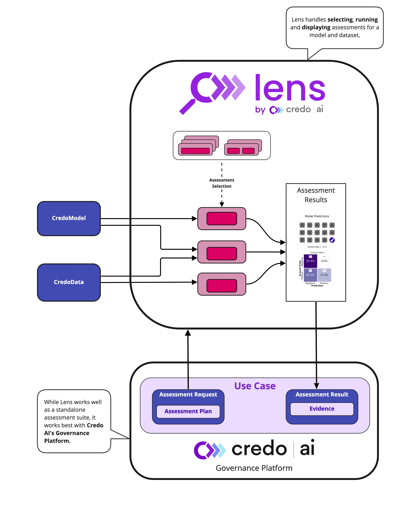

.. toctree::
   :hidden:

   Home page <self>
   Setup <pages/setup>
   Jupyter tutorials <pages/tutorials>
   Developer Guide <pages/developer_guide>
   Evaluators <pages/evaluators>
   Metrics <pages/metrics>
   API reference <_autosummary/credoai>

.. image:: _static/images/credo_ai-lens.png
   :width: 400

Lens is an AI Assessment Framework. With a focus on responsible AI (RAI), Lens makes
comprehensive AI assessment streamlined, structured and interpretable to diverse audiences. Lens
aims to be the single entrypoint to a broad ecosystem of open source assessment
tools. It is especially useful as part of your AI Governance process
when paired with `Credo AI's Platform <https://www.credo.ai/>`_.

Getting started
----------------
#. :ref:`Install Lens <setup>`.
#. Run the :ref:`quickstart tutorial <quickstart>`. 

   * This will verify that Lens is properly installed and introduce you to its functionality.
  
#. If using Lens with the Credo AI Platform, run the :ref:`platform integration tutorial <credo ai platform integration>`.

   * This tutorial will take you through setting up an API connection, and integrating your assessment
     code with governance requirements.

For other questions, check out the :ref:`FAQ <lens faq>` for answers to common questions.

Overview
--------
Lens allows you to assess your AI systems with respect to a number of RAI considerations including
Fairness, Performance, Security and more. See :ref:`evaluators` for a full list of Lens's
evaluation capabilities.

Lens runs a ``pipeline`` of ``evaluators`` which assess your model and datas along multiple 
dimensions. Each evaluator is focused on a limited set of assessments, but they can be strung
together to create a comprehensive view of the characteristics of your model and/or data. 
Evaluators create ``evidence`` as their output.

Your model and datas are wrapped in Lens-specific classes which make them understandable to the
overall framework. Different classes are used for different types of models. For instance, 
``TabularData`` is used to wrap tabular dataframes.

When developing AI systems responsibly, comprehensive assessment is only one (important) component
of your development flow. Equally important is determining which assessments to run, and using
those assessments to make decisions about the development or deployment of your AI system. These
other processes, when combined with proper assessment is what is called **AI Governance**. 

Lens uses a ``Governance`` object to connect with the Credo AI Governance Platform. This allows your
governance team to communicate assessment directly into a programmatic assessment, and allows
the assessment results to immediately be translated into digestible reports on the platform.

Glossary
--------

Lens
   The primary interface between models, data, and evaluators. Lens performs an orchestration
   function. It interacts with an (optional) Governance object, generates or ingests a user-specified
   pipeline of evaluators, runs those evaluators, and defined functions to access the results.

Evaluators
   The workhorses of the framework. Evaluators are the classes that perform specific functions on 
   a model and/or data. These can include assessing the model for fairness, or profiling a 
   data. Evaluators are constantly being added to the framework, which creates Lens's standard
   library. Custom evaluators can also be defined and brought into the framework.

   Evaluators generally require specific kinds of Models or Data to run. For instance, a specific
   evaluator may require ``TabularData`` and a ``ClassificationModel``.

Model
   A Model in Lens is a type of AI artifact that wraps a trained model. Model types are defined
   by their functionality generally, rather than their framework. For instance, a 
   ``ClassificationModel`` can wrap any model that has a ``predict`` function defined. As such,
   Lens as a whole is framework-agnostic.

Data
   Data ins Lens is another type of AI artifact that wraps a dataset. Different data classes
   support different types of data (e.g. ``TabularData``). When passed to Lens, Data can either be
   labeled "training_data" or "assessment_data". The latter will be used for assessments of the model,
   while the former is passed when assessments of the training data itself is desired, or some
   assessment requires it

Usage of Lens boils down to creating the artifacts you want to assess (Model and/or Data), defining
a pipeline of evaluators (or connecting Lens to Governance), and running Lens. 

Architecture Diagram
--------------------

